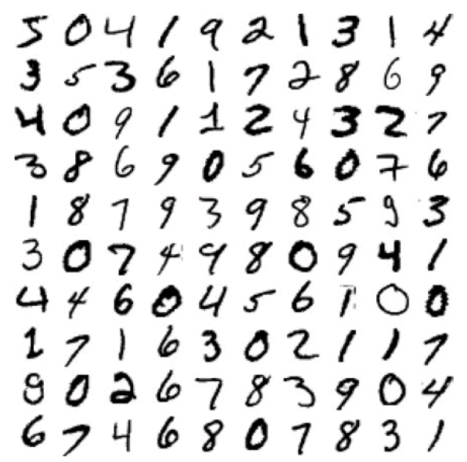

# 3장.분류

추가 일시: 2025년 7월 28일 오후 7:28
작성자: 길주현[학생](생명과학대학 유전생명공학과) ‍

# 3.1 Mnist

- Mnist란?
    
    → 손으로 쓴 70,000개의 숫자 이미지 데이터셋
    
    
    

# 3.2 이진 분류기

- 이진 분류기란?
    
    → 두 개의 클래스 구분(ex. `5` 와 `5 아님` 구분)
    
- `확률적 경사 하강법(SGD)` 사용

```python
# 앞쪽 60,000개 : 훈련 세트 / 뒤쪽 10,000개 : 테스트 세트
X_train, X_test, y_train, y_test = X[:60000], X[60000:], y[:60000], y[60000:]

y_train_5 = (y_train == '5')
y_test_5 = (y_test == '5')

# 분류 모델 제작
from sklearn.linear_model import SGDClassifier
sgd_clf = SGDClassifier(random_state=42)
sgd_clf.fit(X_train, y_train_5)
```

# 3.3 성능 측정

1. k-fold 교차 검증
2. 오차 행렬
3. 정밀도와 재현율

### 3.3.1 k-fold 교차 검증

- `cross_val_score()` 함수 사용

```python
from sklearn.model_selection import cross_val_score
cross_val_score(sgd_clf, X_train, y_train_5, cv=3, scoring='accuracy')
```

- 정확도는 분류기의 성능 지표로 선호하지 않음 !! ****

### 3.3.2 오차 행렬

- 예측값 제작
    - `cross_val_predict()` 함수 사용

```python
from sklearn.model_selection import cross_val_predict
y_train_pred = cross_val_predict(sgd_clf, X_train, y_train_5, cv=3) 
# 각 폴드마다 2개의 폴드로 sgd_clf학습, 나머지 1개 fold에 대해 에측
```

- 오차 행렬 만들기

```python
from sklearn.metrics import confusion_matrix
cm=confusion_matrix(y_train_5, y_train_pred)
```

| **실제↓ / 예측→** | 5 아님 | 5 맞음 |
| --- | --- | --- |
| 5 아님 | 53892(진짜 음성, TN) | 687(거짓 양성, FP) |
| 5 맞음 | 1891(거짓 음성, FN) | 3530(진짜 양성, TP) |

### 3.3.3 정밀도와 재현율

- 정의
    - 정밀도
        
        $정밀도 = TP / (TP + FP)$
        
    - 재현율
        
        $재현율 = TP / (TP + FN)$
        
    - 오차 행렬에서의 표현
        
        
        
    - F1 점수
        
        → 정밀도와 재현율의 조화평균 (`정밀도`와 `재현율`이 모두 높아야 `F1 점수`가 높다)
        
        ```python
        from sklearn.metrics import f1_score
        f1_score(y_train_5, y_train_pred)
        ```
        

- 정밀도/재현율 트레이드오프
    - `정밀도`를 올리면 `재현율`이 줄어든다 (반대도 마찬가지)
        
        
        

### 3.3.4 ROC(수신기 조작 특성) 곡선

- `FPR`에 대한 `TPR`의 곡선
    - FPR(거짓 양성 비율) : 양성으로 잘못 분류된 음성 샘플의 비율
        
        $FPR = 1 - TNR$
        
    - TPR(진짜 양성 비율)
    - TNR(진짜 음성 비율) : 음성으로 정확하게 분류된 음성 샘플의 비율
        
        
        

→ 좋은 분류기일수록 점선에서 멀어짐! 

즉, `곡선 아래 면적(AUC)`이 1에 가까울 수록 더 완벽한 분류기!

```python
from sklearn.metrics import roc_auc_score
roc_auc_score(y_train_5, y_scores)
```

- 랜덤 포레스트와 비교
    
    
    
    → 랜덤 포레스트의 PR곡선이 SGDClassifier의 곡선보다 더 오른쪽 위 모서리에 가깝다. (더 성능 good)
    

# 3.4 다중 분류

- `OvR`(`OvA`) 전략 : 숫자별 이진 분류기 여러개를 훈련시켜 각 분류기의 결정 점수 중에서 가장 높은 것을 클래스로 선택
- `OvO` 전략 : 각 숫자의 조합마다(0,1 구별 / 0,2 구별 등) 이진 분류기 훈련, 가장 많이 양성으로 분류된 클래스 선택
    - 장점 : 분류기 훈련에 구별할 두 클래스의 샘플만 있으면 된다.

# 3.5 오류 분석

- 모델의 성능을 향상시킬 방법 찾기

- 오차행렬 분석
    
    
    


→ 모델이 5이미지를 8로 잘못 예측하는 경우가 많다 !!

→ 왜 이런일이 일어나지?

- 오류 분석을 통한 분석기의 역할 탐색 ex. 3,5의 오차 행렬 스타일 샘플
    
    
    
    → 3,5의 차이 : 왼쪽 선과 아래 호를 이어주는 작은 직선 위치. 3을 쓸 때 연결 부위가 왼쪽으로 치우치면 5로 분류함.
    
    → 분류기는 이미지의 위치나 회전 방향에 매우 민감하다!
    

# 3.6 다중 레이블 분류

- 정의 : 여러 개의 이진 꼬리표를 출력하는 분류 시스템
- ex. 숫자가 큰 값(7,8,9)인지 + 홀수인지

```python
import numpy as np
from sklearn.neighbors import KNeighborsClassifier

y_train_large=(y_train >= '7')
y_train_odd=(y_train.astype('int8') % 2==1)
y_multilabel=np.c_[y_train_large, y_train_odd]

knn_clf=KNeighborsClassifier()
knn_clf.fit(X_train, y_multilabel)

>>> knn_clf.predict([some_digit])
array([[False,  True]])
# 5는 크지않고, 홀수이다
```

- 다중 레이블 분류기의 평가
    - 각 레이블의 F1점수의 평균 구하기
    
    
    
    → 모든 레이블의 가중치가 같다고 가정함. 
    
    → 실제 상황에선 안맞을수도??!! 
    
    → 레이블에 클래스의 지지도(타깃 레이블에 속한 샘플 수)를 가중치로 두자!
    

# 3.7 다중 출력 분류

- 다중 레이블 분류에서 한 레이블이 다중 클래스가 될 수 있도록 일반화(값을 두 개 이상 가질 수 있다)
- ex. 잡음 제거
    
    
    
    - 이미지를 깨끗하게 만들기
    
    ```python
    knn_clf=KNeighborsClassifier
    knn_clf.fit(X_train_mod, y_train_mod)
    clean_digit=knn_clf.predict([X_test_mod[0]])
    plot_digit(clean_digit)
    plt.show()
    ```
    
    