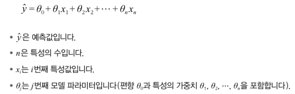

# 4장. 모델 훈련

추가 일시: 2025년 7월 28일 오후 7:30

# 4.1 선형 회귀

- 선형 회귀 모델의 예측
    
    
    


→ `MSE(평균제곱오차)` 를 최소화 하는 Theta를 찾아야 함.


### 4.1.1 정규방정식

- 비용 함수를 최소화하는 Theta 값을 찾기 위한 해석적인 방법
    
    
    
    → 데이터 셋이 작고, 잡음 많을수록 정확히 예측 어려움!
    
- 모델의 예측
    
    
    

### 4.1.2 계산 복잡도

- 특성 수 : 두 배 → 계산 시간 : 5.3(2^2.4) ~ 8(2^3)배
- 샘플이 두 배 → 걸리는 시간도 두 배

# 4.2 경사 하강법(GD)

- 기본 아이디어 : 비용 함수를 최소화하기 위해 반복적으로 파라미터 조정(MSE가 감소되는 방향)
    
    
    
- 학습률에 따른 문제
    1. 학습률이 적을 때 
        
        → 수렴하기 위한 많은 반복작업으로, 시간 증가
        
        
        
    2. 학습률이 너무 클 때
        
        → 알고리즘을 더 큰 값으로 발산하게 만듦
        
        
        
- 경사하강법의 문제점
    1. 랜덤 초기화 문제
        - 알고리즘이 왼쪽에서 시작 : 전역 최솟값보다 덜 좋은 지역 최솟값에 수렴
        - 알고리즘이 오른쪽에서 시작 : 평지를 지나기 위한 시간이 오래 걸려 전역 최솟값에 도달x
        
        
        
    2. 특성들의 스케일이 매우 다를 경우, 시간이 오래 걸림(오른쪽)
        
        
        

### 4.2.1 배치 경사 하강법

- 경사 하강법 구현을 위해서, `편도함수` 필요
    
    : Theta가 조금 변경될 때 비용 함수가 얼마나 바뀌는지(Theta에 대한 비용 함수의 그레이디언트)계산
    
    
    
    next step : 위로 향하는 gradient 벡터가 구해지면, 반대 방향인 아래로 가야함
    
    
    
    n : 학습률
    
    - 모델 구현
    
    ```python
    eta = 0.1 #학습률
    n_epochs = 1000
    m = len(X_b) # 샘플 개수
    np.random.seed(42)
    theta = np.random.randn(2, 1) # 모델 파라미터를 랜덤하게 초기화합니다.
    for epoch in range(n_epochs):
    gradients = 2/ m * X_b.T @ (X_b @ theta - y)
    theta = theta - eta * gradients
    ```
    
    
    
- 단점 : 훈련 세트가 커지면 매우 느려진다.

### 4.2.2 확률적 경사 하강법

- 매 스텝에서 한 개의 샘플을 랜덤으로 선택하고 그 샘플에 대한 그레디언트 계산
- 비용 함수가 최솟값에 다다를 때까지 위아래로 요동치며 평균적으로 감소
    
    
    
- 알고리즘 구현

```python
n_epochs = 50
t0, t1 = 5, 50 #학습 스케줄 하이퍼파라미터

def learning_schedule(t):
	return t0 / (t + t1)
np.random.seed(42)
theta = np.random.randn (2, 1) # 랜덤 초기화

for epoch in range(n_epochs):
	for iteration in range(m):
		random_index = np.random.randint(m)
		xi = X_b[random_index:random_index + 1]
		yi = y[random_index: random_index + 1]
		gradients = 2 * xi.T @ (xi @ theta - yi) # SGD의 경우 m으로 나누지 않습니다.
		eta = learning_schedule(epoch * m + iteration)
		theta = theta - eta * gradients
```

- 장점 : 알고리즘이 빠르다
- 단점 : 배치 경사 하강법보다 불안정

### 4.2.3 미니배치 경사 하강법

- `미니배치` 라 부르는 임의의 작은 샘플 세트에 대해 그레디언트 계산
- 장점 : 하드웨어(ex. GPU)를 사용해 성능 향상 가능
- 단점 : 지역 최솟값에서 빠져나오기는 힘들지도…?

### 4.2.4 세 가지 경사 하강법 비교

- 훈련 과정 동안 파라미터 공간 경로 비교
    
    
    
- 선형 회귀를 사용한 알고리즘 비교
    
    
    

# 4.3 다항 회귀

- 주어진 데이터가 복잡한 형태(비선형)일 때, 선형 모델을 활용한 학습

```python
# 비선형 데이터 생성
np.random.seed(42)
m = 100
X = 6 * np.random.rand(m, 1) 3
y = 0.5 * X ** 2 + X + 2 + np.random.randn(m, 1)
```

```python
# 훈련 데이터 확장
>>> from sklearn.preprocessing import PolynomialFeatures
>>> poly_features = PolynomialFeatures (degree=2, include_bias=False)
>>> X_poly = poly features.fit transform(X)
>>> X[0]
array([-0.75275929])
>>> X_poly[0]
array([-0.75275929, 0.56664654])
```

```python
# 모델 훈련
>>> lin_reg = LinearRegression()
>>> lin_reg.fit(X_poly, y)
>>> lin_reg.intercept_, lin_reg.coef_
(array([1.78134581]), array([[0.93366893, 0.56456263]]))
```


# 4.4 학습 곡선

- 모델의 일반화 성능을 추정하기 위한 방법
- 정의 : 모델의 훈련 오차와 검증 오차를 훈련 반복 횟수의 함수로 나타낸 그래프
- 과소적합 학습 곡선
    
    
    
    → 왜 과소적합?
    
    훈련 오차 : 곡선이 평편해질 때까지 오차가 계속 상승
    
    검증 오차 : 선형 회귀의 직선은 데이터를 제대로 모델링 못하므로, 오차가 완만하게 감소하며 훈련세트 그래프와 가까워짐
    

# 4.5 규제가 있는 선형 모델

- 선형 회귀 모델 : 모델의 가중치를 제한함으로써 규제를 가한다.
- 가중치 제한 방법에 따른 회귀 분류

### 4.5.1 릿지 회귀

- 하이퍼파라미터(a)에 따른 모델 변화
    - a가 증가할수록 직선에 가깝다(모델의 분산은 줄지만 편향은 커진다)
    
    
    
- 릿지 회귀의 정규 방정식


### 4.5.2 라쏘 회귀

- l2 노름이 아닌 가중치 벡터의 l1노름 사용(l1 노름에 2a를 곱한다.)
    
    
    
- 덜 중요한 특성의 가중치를 제거한다.

### 4.5.3 엘라스틱넷

- 릿지 회귀와 라쏘 회귀를 절충한 모델
- 규제항 : 릿지의 규제항 + 회귀의 규제항
- 혼합 비율(r)에 따른 조절
    - r=0 : 릿지 회귀와 동일
    - r=1 : 라쏘 회귀와 동일

### 4.5.4 엘라스틱넷, 릿지, 라쏘, 일반적인 선형 회귀 사용 구분

- 기본 : 릿지
- 몇 가지 특성만 유용 : 라쏘 or 엘라스틱넷
- 특성 수가 샘플 수보다 많거나 특성 몇 개가 강하게 연관 : 엘라스틱넷

### 4.5.5. 조기 종료

- 검증 오차가 최솟값에 도달하면 바로 훈련을 중지
    
    
    
    → 감소하던 검증 오차가 멈추었다가 다시 상승 : 훈련 데이터에 과대적합되기 시작함.
    

# 4.6 로지스틱 회귀

- 분류에서 사용되는 회귀 알고리즘
- 로지스틱 회귀 : 샘플이 특정 클래스에 속할 확률 추정

### 4.6.1 확률 추정

- 입력 특성의 가중치 합 계산 → 결괏값의 로지스틱 출력


- 로지스틱 회귀 모델이 샘플 x가 양성 클래스에 속할 확률을 추정.
    
    
    
    - 양수 : 1 (양성 클래스)
    - 음수 : 0 (음성 클래스)
        
        
        

### 4.6.4 소프트맥스 회귀

- 로지스틱 회귀 모델이 직접 다중 클래스를 지원하도록 일반화 (여러 개의 이진 분류기 훈련시켜 연결x)
- 샘플 x가 주어지면, 소프트맥스 회귀 모델이 각 클래스 k에 대한 점수 s_k(x)를 계산하고, 그 점수에 소프트맥스 함수를 적용하여 각 클래스의 확률 추정
- 샘플x에 대해 각 클래스의 점수가 계산된 후, 소프트맥스 함수를 통과시켜 클래스 k에 속할 확률 추정


- 소프트맥스 회귀 분류기 : 추정 확률이 가장 높은 클래스 선택

