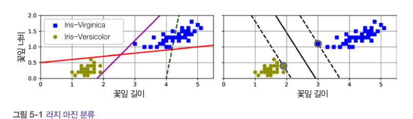
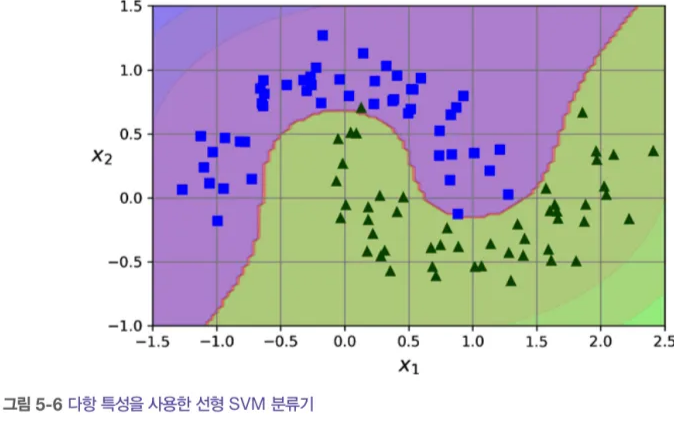

# 5장_서포트 벡터 머신

# 5. 서포트 벡터 머신(SVM)

- 장점
    1. 매우 강력
    2. 다목적(선형/비선형 분류, 회귀, 특이치 탐지 가능)
    3. 중소규모 비선형 데이터셋(특히, 분류 작업)에서 강점
- 단점
    - 매우 큰 데이터셋으로 잘 확장되지 않는다

## 5.1 선형 SVM 분류

- 클래스가 직선으로 구분
- 왼쪽 그림
    - 점선 : 클래스의 구분x
    - 나머지 두 직선 : 경계가 샘플에 너무 가까움 → 새로운 샘플에 대해 잘 작동x
- 오른쪽 그림
    - 실선 : 결정 경계
        
        → 클래스 사이에 가장 폭이 넓은 도로 찾기 (**`라지 마진 분류`**) 
        
    - 도로 바깥쪽에 훈련 샘플을 더 추가해도 결정 경계에 영향x
        
        → 서포트 벡터
        

💡 SVM은 특성의 스케일에 민감!! (사이킷런의 StandardScaler 사용)

### 5.1.1. 소프트 마진 분류

- 하드 마진 분류
    - 정의 : 모든 샘플이 도로 바깥쪽에 올바르게 분류
    - 문제점
        1. 데이터가 선형적으로 구분되어야 제대로 작동
        2. 이상치에 민감
            
            
            
    
    ❗  마진 오류 : 샘플이 도로 중간이나 반대쪽에 있는 경우
    
- 소프트 마진 분류
    - 정의 : 도로의 폭을 넓게 유지 + 마진 오류 사이 균형 잡기
        
        
        
        **C : 규제 하이퍼 파라미터**
        
        → SVM 모델이 과대적합이면 C를 감소시켜 모델 규제! (단, 너무 많이 줄이면 모델이 과소적합 가능성)
        
    

## 5.2 비선형 SVM 분류

- 다항 특성과 같은 특성 더 추가

### 5.2.1. 다항식 커널

- 커널 트릭 : 실제로는 특성을 추가하지 않으면서 다항 특성을 많이 추가한 것과 같은 결과를 얻게 해줌
- 모델이 과대적합 : 다항식 차수 줄이기
- 모델이 과소적합 : 다항식 차수 늘리기

→ `coef0` : 매개변수 / 모델이 높은 차수, 낮은 차수에 얼마나 영향 받을지 조절

### 5.2.2. 유사도 특성

- 비선형 특성 다루기 : 유사도 함수로 계산한 특성 추가
    - 유사도 함수 : 각 샘플이 특정 랜드마크와 얼마나 닮았는지 측정
        
        
        
        - `x1 = -2`, `x1= 1` 두 개의 랜드마크 추가
        - 유사도 함수 : `r=0.3`인 가우스 방사 기저 함수(RBF)
        
        
        
        → `x1 = -1`  샘플 : 첫 번째 랜드마크에서 1 떨어짐, 두 번째 랜드마크에서 2 떨어짐.
        
        따라서, x2 = exp(-0.3 * 1^2) = 0.74, x3 = exp( -0.3 * 2^2) = 0.3
        
- 랜드마크 선택
    - 데이터셋에 있는 모든 샘플 위치에 랜드마크 설정
        - 장점 : 차원이 매우 커져 변환된 훈련 세트가 선형적으로 구분될 가능성 증가
        - 단점 : 훈련 세트가 매우 클 경우 동일한 크기의 매우 많은 특성이 만들어짐

### 5.2.3. 가우스 RBF 커널

- 유사도 특성 방식의 추가 특성을 모두 계산하려면 연산 비용이 많이 든다.
    
    → 커널 트릭이 유용!!
    
    
    
    - 큰 gamma : 결정 경계가 불규칙, 각 샘플을 따라 휘어짐
    - 작은 gamma : 결정 경계가 부드러워짐, 샘플이 넓은 범위에 걸쳐 영향을 준다
        
        → 💡 r(하이퍼 파라미터) : 과대 적합일 경우 감소, 과소적합일 경우 증가 시켜야 한다 !!
        
- 다른 커널의 종류 (거의 사용 x)
    - 문자열 커널 : 텍스트 문서, DNA 서열 분류에 사용

### 5.2.4. 계산 복잡도

- LinearSVC
    - 커널트릭 지원 x , 훈련 샘플과 특성 수에 거의 선형적으로 늘어남.
    - 훈련 시간 복잡도 = O(m x n)
    - 정밀도를 높이면 알고리즘의 수행 시간 길어짐 (허용 오차 하이퍼파라미터로 조절)

- SVC
    - O(m^2 x n) < 훈련 시간 복잡도 < O(m^3 x n)
        
        → 훈련 샘플 수가 커지면 매우 느려진다
        
    - 중소규모의 비선형 훈련 세트에 적합
    - 특성의 수에 대해서는 잘 확장됨.
        - 특히, 희소 특성(각 샘플에 0이 아닌 특성이 몇 개 없는 경우)인 경우
            
            → 샘플이 가진 0이 아닌 특성의 평균수에 알고리즘 성능이 비례한다.
            

- SGDClassifier
    - 라지 마진 분류 수행
        
        → 하이퍼파라미터와 learning_rate를 조정하여 선형 SVM과 유사한 결과 생성
        
    - 훈련을 위한 점진적 학습 가능, 확률적 경사 하강법 사용
    - 대규모 데이터셋에서 모델 훈련 가능
    - 계산 복잡도 = O(m x n)
        
        → 확장성 뛰어남
        
        
        
    

## 5.3 SVM 회귀

- 제한된 마진 오류(도로 밖의 샘플) 안에서 도로 안에 가능한 많은 샘플이 들어가도록 학습
    - 도로 폭 : 하이퍼 파라미터(앱실론)로 조절
        
        
        
    - 왼쪽 그래프 : 마진이 작다
    - 오른쪽 그래프 : 마진이 크다
        
        → 마진 안에서는 훈련 샘플이 추가되어도 모델 예측에 영향 x (앱실론에 민감하지 않다)
        

- 비선형 회귀 작업 : 커널 SVM 모델 사용
    - 왼쪽 그래프 : 규제가 약간 있음 (작은 C)
    - 오른쪽 그래프 : 규제가 훨씬 적다(큰 C)

- SVR vs SVC
    - SVR : SVC의 회귀 버전
        
        → 훈련 세트가 커지면 시간이 훨씬 느려짐
        
- LinearSVR vs LinearSVC
    - LinearSVR : LinearSVC의 회귀 버전
        
        → 필요한 시간이 훈련 세트의 크기에 비례해서 선형적으로 늘어남
        

## 5.4 SVM 이론

- 선평 SVM 분류기 모델
    - 결정 함수를 계산해서 새로운 샘플 x의 클래스 예측
    
    
    
    → 결괏값
    
    1. 0보다 클 때 : 예측된 클래스는 양성 클래스(1)
    2. 0보다 작을때 : 예측된 클래스는 음성 클래스(0)
    
    - 훈련
    
    ❗ 마진 오류 횟수 제한 + 도로(마진)을 가능한 넓게 만들어야 함!!
    
    어떻게?
    
    → 도로의 너비 넓히기 : 가중치 벡터(w) 작게 
    
     편향(b) : 마진의 크기에 영향x, 위치만 이동시킴
    
    ⬇️ 아래 그래프 :
    
    결정함수(w1x1)가 -1 or 1 인 포인트
    
    - 왼쪽 : 마진의 크기 = 2
    - 오른쪽 : 마진의 크기 = 4
    
    
    

- 하드 마진 선형 SVM 분류기

→ 마진 오류를 피하기 위함

1. 양성 훈련 샘플 : 결정 함수가 1보다 커야함
2. 음성 샘플 : 결정 함수가 -1보다 작아야함

- 소프트 마진 분류기

→ 각 샘플에 대해 슬랙 변수(i 번째 샘플이 얼마나 마진을 위반할지 정함) 도입

- 두 개의 목표
    1. 마진 오류 최소화 ( 가능한 한 슬랙 변수의 값 작게 하기)
    2. 마진 크게 하기 ( 1/2 w^T * w 가능한 한 작게 만들기)
    
    → 서로 상충되는 목표 !
    

- 콰드라틱 프로그래밍(QP)
    - 하드 마진, 소프트 마진 모두 선형적인 제약 조건이 있는 볼록 함수의 이차 최적화 문제

- SVM 훈련법
    1. QP 솔버
    2. 경사 하강법
        
        → 힌지 손실 or 제곱 힌지 손실 최소화
        
    
    
    
    💡 샘플이 마진에서 반대로 멀어질수록 손실이 커진다 !!
    
    - 힌지 손실 : 선형적으로 증가
    - 제곱 힌지 손실 : 이차 방정식으로 증가 (이상치에 더 민감하게 반응)

## 5.5 쌍대 문제

- 원 문제(primal problem) : 제약이 있는 최적화 문제
- 쌍대 문제(Dual problem) : 깊게 관련된 다른 문제
    
    → 원 문제가 주어지면 쌍대 문제로 표현 가능
    
    ❗ SVM문제는 원 문제의 해와 쌍대 문제의 해가 같다
    

-QP 솔버를 사용해 이 식을 최소화 하는 벡터 (alpha) 찾기

-원 문제의 식을 최소화하는 w, b계산

- 훈련 샘플 수가 특성 개수보다 작을 때 : 쌍대 문제 푸는 것이 더 빠름 + 커널 트릭이 가능

### 5.1.1. 커널 SVM

- 커널 트릭이란?
    
    → 모든 훈련 샘플에 변환 pi를 적용해서 선형 SVM 알고리즘을 적용 하면 계산량 측면에서 비효율
    
    따라서, 변환 pi를 적용하지 않고, 벡터의 점곱을 간단하게 표현.
    

- 식 5-4의 문제점

→ 커널 트릭을 사용한다면 예측식에 결국 pi(x^(i))를 포함하게 됨 (차원이 매우 커져 계산이 불가능해진다)

💡 w에 대한 식을 입력 벡터 간의 점곱으로만 된 식을 얻을 수 있음

