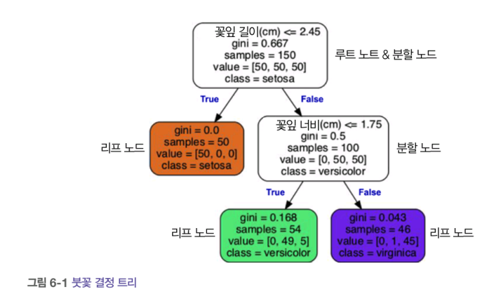

# 6장_결정트리

추가 일시: 2025년 8월 3일 오후 1:28

# 6. 결정 트리

- 다목적 머신러닝 알고리즘 (분류 + 회귀 + 다중 출력 작업)

## 6.1 결정 트리 학습과 시각화

## 6.2 예측

- ex) 새로 발견한 붓꽃의 품종 분류
    - 루트 노드
    
    : 꽃잎의 길이가 2.45cm보다 짧은지 검사
    
    → True : 리프 노드 (꽃의 품종은 Iris-Setosa라고 예측)
    
    → False : 분할노드
    
    - 꽃잎의 너비가 1.75cm보다 작은지 검사
        
        → True : Iris-Versicolor
        
        → False : Iris-Virginica
        
    
    
    

💡 모델 해석 

- 화이트박스 : 직관적, 결정 방식 이해가 쉬움 (ex. 결정 트리)
- 블랙 박스 : 왜 그런 예측을 만들었는지 설명 어려움(ex. 랜덤 포레스트, 신경망)

## 6.3 클래스 확률 추정

- 한 샘플이 특정 클래스 k에 속할 확률 추정
- 해당 샘플의 리드 노드에 있는 클래스 k의 훈련 샘플의 비율 반환
    
    ex. 길이 5cm, 너비 1.5cm 꽃잎 : 깊이2, 왼쪽 노드
    
    - Iris-Setosa : 0% (0/54)
    - Iris-Versicolor : 90.7% (49/54)
    - Iris-Versicolor : 9.3% (5/54)

## 6.4 CART 훈련 알고리즘

- 사이킷런 : 결정 트리를 훈련(트리 성장)시키기 위해 CART 알고리즘 사용
- 훈련 세트를 두 개의 커브셋으로 나눔(특성 k, 임곗값 t_k 사용) - ex. 꽃잎의 길이 ≤ 2.45cm
- (k, t_k)쌍 찾기

→ 비용 함수를 최소화 해야함

## 6.5 계산 복잡도

결정 트리 탐색을 위해서는 O(log_2(m))개의 노드를 거쳐야함.

- 특징 : 예측에 필요한 전체 복잡도는 특성 수와 무관
    
    → 큰 훈련 세트를 다룰 때도 예측 속도가 매우 빠름
    

## 6.6 지니 불순도 또는 엔트로피?

- `DecisionTreeClassifier` : 지니 불순도 사용

그러나, criterion 매게 변수를 ‘entropy’로 지정하여 엔트로피 불순도 사용 가능.

- 엔트로피 개념은 머신러닝에서 불순도의 측정 방법으로 자주 사용된다.
    - 어떤 세트가 한 클래스의 샘플만 담고 있으면 엔트로피가 0

- 지니 불순도 vs 엔트로피

❗사실, 둘 다 비슷한 트리 만듦

- 지니 불순도 : 조금 더 빠른 계산
- 엔트로피 : 조금 더 균형 잡힌 트리

## 6.7 규제 매개변수

- 결정 트리 : 비파라미터 모델
    - 훈련되기 전에 파라미터 수가 결정되지 않는다 → 모델 구조가 데이터에 맞춰지지 않고 자유롭다
    
    ❗과대 적합 되기 쉬움
    
    따라서, 과대 적합을 피하기 위해 결정트리 자유도 제한 
    
    - `max_depth`
    - `max_features`
    - `max_leaf_nodes`
    - `min_samples_split`
    - `min_samples_leaf`
    - `min_weight_fraction_leaf`
    
    
    
    ## 6.8 회귀
    

- 분류트리와 차이 : 각 노드에서 클래스를 예측하는 대신 값을 예측
- 회귀에서도 결정트리가 과적합 되기 쉽다. 따라서, 규제를 사용한다

## 6.9 축 방향에 대한 민감성

- 결정트리 : 계단 모양의 결정 경계 → 데이터의 방향에 민감 !!

- 왼쪽 결정 트리 : 데이터셋 쉽게 구분
- 오른쪽 결정 트리 : 왼쪽 데이터를 45도 회전, 잘 일반화 x
    
    → 일반화 문제 해결법 : 데이터의 스케일 조정 후 PCA 변환 적용(특성 간의 상관관계를 줄이는 방식으로 데이터를 회전하여 결정 트리를 더 쉽게 만들 수 있다)
    
    
    

## 6.10 결정 트리의 분산 문제

❗일반 적인 결정 트리의 주요 문제 : 분산이 상당히 크다

- 하이퍼 파라미터나 데이터를 조금만 바꿔도 매우 다른 모델이 생성됨 !
- `random_state` 매게 변수 설정 x

→ 6.2의 모델과 매우 다르다