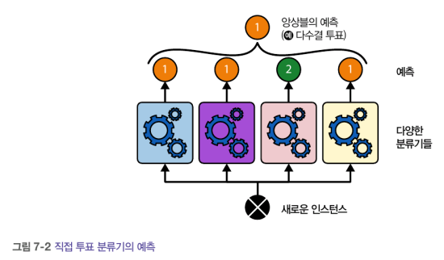

# 7장_앙상블 학습과 랜덤 포레스트

추가 일시: 2025년 8월 7일 오후 12:09

# 7. 앙상블 학습과 랜덤 포레스트

- 앙상블 학습이란?

> `앙상블`(분류나 회귀모델 등 인련의 예측기)로부터 예측을 수집하여 더 좋은 예측을 얻는 방식. 이러한 학습 알고리즘을 `앙상블 방법`이라고 한다
> 

ex. **랜덤 포레스트** : 결정 트리의 앙상블

## 7.1 투표 기반 분류기

- 직접 투표 : 각 분류기의 예측을 집계하여 가장 많은 표를 얻은 클래스가 앙상블의 예측이 되는 방식



- 간접 투표 : 개별 분류기의 예측을 평균 내어 확률이 가장 높은 클래스 예측
    
    > 직접 투표보다 성능이 높다
    > 

## 7.2 배깅과 페이스팅

💡 같은 훈련 알고리즘을 사용하며, 훈련 세트의 서브셋을 랜덤으로 구상하여 분류기를 다르게 학습시키자!

- 배깅(bootstrap aggregating) : 훈련 세트에서 중복을 허용하여 샘플링
- 페이스팅 : 중복을 허용하지 않고 샘플링


❗ 앙상블은 모든 예측기의 예측을 모아서 새로운 샘플을 예측 

- 분류 : 통계적 최빈값 계산
- 회귀 : 평균 계산

💡앙상블의 결과 : 원본 데이터셋으로 하나의 예측기를 훈련시킬 때와 편향은 비슷. 그러나 분산은 감소

### 7.2.1 사이킷런의 배깅과 페이스팅

> `BaggingClassifier` (회귀 : `BaggingRegressor` )
> 

```python
from sklearn.ensemble import BaggingClassifier
from sklearn.tree import DecisionTreeClassifier

bag_clf = BaggingClassifier(DecisionTreeClassifier(), n_estimators=500, 
max_samples=100, n_jobs=-1, random_state=42)

bag_clf.fit(X_train, y_train)
```


- 배깅이 페이스팅보다 편향이 조금 더 높음 (그러나, 배깅은 서브셋에 다양성을 추가하므로 앙상블의 분산이 줄어듬)

> 일반적으로 배깅이 더 선호됨 !
> 

### 7.2.2 OOB 평가

> 배깅 사용시, 어떤 샘플은 여러번 샘플링되고, 어떤 것은 전혀 선택되지 않을 수 있다.
> 

`BaggingClassifier` : 훈련 세트의 크기만큼인 m개 샘플 선택

→ 각 예측기에 훈련 샘플의 63% 정도만 샘플링 됨. 선택되지 않은 37% : `OOB 샘플` 

💡 앙상블의 평가 : OOB 평가를 평균하여 획득!

## 7.3 랜덤 패치와 랜덤 서브스페이스

- `BaggingClassifier` : 특성 샘플링또한 지원
    
    → `max_features` , `bootstrap_features`  두 매개변수로 조절
    

> 예측기는 랜덤으로 선택한 입력 특성의 일부분으로 훈련된다. (고차원 데이터셋 다룰 때 유용)
> 

- 랜덤 패치 방식 : 훈련 특성과 샘플을 모두 샘플링
- 랜덤 서브스페이스 방식 : 훈련 샘플을 모두 사용하고 특성을 샘플링

## 7.4 랜덤 포레스트

- `max_samples` 을 훈련 세트의 크기로 지정

### 7.4.1 엑스트라 트리

> 최적의 임곗값을 찾는 대신 후보 특성을 사용해 랜덤으로 분할 → 최상의 분할 선택
> 

 어떻게 ? `splitter='random'` 지정 !!

- 익스트림 랜덤 트리(엑스트라 트리) : 극단적으로 랜덤한 트리의 랜덤 포레스트 (편향 증가, 분산 감소)

### 7.4.2 특성 중요도

❗랜덤 포레스트는 특성의 상대적 중요도 측정이 쉽다!

(사이킷런은 훈련이 끝난 뒤 가중치의 평균(특성의 중요도) 측정)


## 7.5 부스팅

> 부스팅이란?
> 

→ 약한 학습기를 여러 개 연결하여 강한 학습기를 만드는 앙상블 방법

❗앞의 모델을 보완해 나간다

### 7.5.1 AdaBoost

💡이전 모델이 과소적합했던 훈련 샘플의 가중치를 높이기


- AdaBoost 알고리즘
1. 첫 번째 예측기가 학습된 후 가중치가 적용된 오류율(r1)이 훈련 세트에 대해 계산됨
    
    
    
2. 예측기의 가중치(alpha_j) 계산
    1. n : 학습률 하이퍼파라미터, 기본값 = 1.
    2. 예측기가 정확할수록 가중치 증가
    
    
    
3. 샘플의 가중치 업데이트 (잘못 분류된 샘플의 가중치 증가)
    
    
    
4. 새 예측기가 업데이트된 가중치를 사용해 훈련되고 전체 과정 반복
5. 지정된 예측기 수에 도달하거나 완벽한 예측기가 만들어지면 중지

❗ 예측 결과 = 모든 예측기의 예측 계산 + 예측기 가중치 (alpha_j) 둘을 더함

### 7.5.2 그레이디언트 부스팅

> 반복마다 샘플의 가중치를 수정하는 대신, 이전 예측기가 만든 **잔여 오차**에 새로운 예측기 학습
> 
- Gradient tree boosting(gradient boosted regression tree) : 결정트리를 기반 예측기로 사용하는 회귀 풀이

ex)

1. 2차 방정식 데이터 셋 생성 후 첫 번째 DecisionTreeRegressor 학습
2. 첫 번째 예측기에서 생긴 잔여 오차에 두 번째 DecisonTreeRegressor 훈련
3. 두 번째 에측기가 만든 잔여 오차에 세 번째 회귀 모델 훈련
4. 새로운 셈플에 대한 예측을 만들기 위해 모든 트리의 예측 더하기
    
    
    
    - 왼쪽 열 : 세 트리의 예측
    - 오른쪽 열 : 앙상블의 예측
    
    1. 첫 번째 행 : 앙상블에 트리 1개. 따라서, 첫 번째 트리의 예측과 같다
    
    2. 두 번째 행 :  새로운 트리가 첫 번째 트리의 잔여 오차에 대해 학습 (앙상블예측 = 두 개의 트리 예측 합)
    
    3. 세 번째 행 : 두 번재 트리의 잔여 오차에 대해 훈련(트리가 앙상블에 추가될수록 앙상블의 예측 증가)
    

- GradientBoostingRegressor의 규제
    - 축소
    
    > `learning_rate` : 각 트리의 기여도 조절. 낮게 설정시 학습을 위한 트리가 많이 필요하지만 예측의 성능은 좋아짐
    > 
    - 최적의 트리 개수 찾기
    
    > `n_iter_no_charge` : 너무 낮게 설정시 과소적합, 너무 높게 설정시 과대적합.
    > 
    - 확률적 그레이디언트 부스팅
    
    > `subsample`: 트리가 훈련할 때 사용할 훈련 샘플의 비율 지정. 편향이 높아지는 대신 분산이 낮아지고 훈련 속도가 빨라짐
    > 
    

### 7.5.3 히스토그램 기반 그레이디언트 부스팅

- Histogram-Based Gradient Boosting(HGB) : 입력 특성 구간을 나누어 정수로 대체

> 구간 개수 : `max_bins` 하이퍼파라미터에 의해  제어
> 

→ 계산 복잡도 = O(b x m) (b : 구간의 개수, m : 훈련 샘플의 개수)

## 7.6 스태킹

> 앙상블에 속한 모든 예측기의 예측을 취합하는 간단한 함수를 사용하는 대신 취합하는 모델을 훈련시킬 수 없을까?
> 
- 새로운 샘플에 대해 회귀 작업을 수행하는 앙상블
    
    
    

→ 세 예측기가 각각 다른 값을 예측하고 마지막 예측기(블렌더)가 예측을 입력으로 받아 최종 예측 만듦

🤔 블렌더 훈련은 어떻게?


1. 블렌딩 훈련 세트 만들기
2. 모든 예측기에서 `cross_val_predict()` 를 사용하여 원본 훈련 세트에 있는 각 샘플에 대한 표본 외 예측 얻기 (블렌더 훈련을 위한 입력 특성)
3. 블렌더가 학습되면 기본 예측기는 원본 훈련 세트로 마지막에 한 번 더 재훈련

💡앙상블 : 다재다능, 강력, 간단 !!

- 랜덤포레스트, AdaBoost, GBRT : 대부분 머신러닝 작업에서 가장 먼저 테스트.
- 투표기반 분류기, 스태킹 분류기 : 시스템 성능 증가에 매우 도움