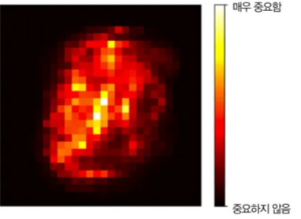
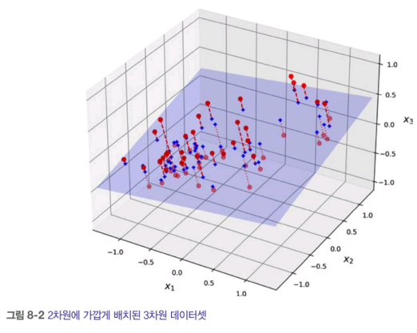

# 8장_차원 축소

추가 일시: 2025년 8월 7일 오후 7:24

# 8장. 차원 축소

> **차원의 저주** 란?
> 

→ 머신러닝 문제에서 훈련 샘플이 매우 많은 특성을 가질 때, 훈련을 느리게 하고 좋은 솔루션을 찾기 어렵다.

❗특성 수를 줄이자!

ex. 



검정색 픽셀들은 분류 문제에 크게 중요x

💡 차원 축소의 장점

1. 훈련속도 증가
2. 데이터 시각화에 유용

## 8.1 차원의 저주

- 고차원 공간
1. 경계에 매우 몰리게 된다
    1. 단위 면적(1 x 1 사각형) 에 있는 점 하나를 무작위로 선택하면, 경계선에서 0.001 이내에 위치할 가능성은 0.4%
    2. 10000차원 초입방체 : 99.999999% 가 경계 근처에 있다
2. 두 점 사이의 거리 증가
    1. 단위 면적에서 임의의 두 점의 거리는 평균적으로 대략 0.52
    2. 3차원 큐브 : 대략 0.66
    3. 1,000,000 차원 : 약 408.25

→ 고차원일수록 훈련 데이터가 서로 멀리 떨어지고, 새로운 데이터도 훈련 샘플과 멀리 있을 가능성이 증가한다.

💡모델이 예측할 때 더 많은 외삽 → 예측 불안정 + 과대적합 위험 증가

🤔 해결책?

→ 훈련 샘플의 밀도가 충분히 높아질 때까지 훈련 세트의 크기 키우기

그런데, 필요한 샘플 수가 차원 수에 다라 기하급수적으로 증가 !

→ 차원을 축소하자!

## 8.2 차원 축소를 위한 접근법

### 8.2.1 투영

> 대부분 실전 문제에서, 모든 훈련 샘플이 고차원 안의 저차원 **부분 공간**에 놓여있다
> 

왜?

1. 많은 특성은 거의 변화x
2. 다른 특성들은 서로 강하게 연관




8-2의 모든 훈련 샘플이 거의 평면 형태로 놓여짐 → 고차원(3D) 공간의 저차원(2D) 부분공간

❗모든 훈련 샘플을 이 부분 공간에 수직으로 투영 → 8-3의 2D 데이터셋

🤔 그런데… 차원 축소에 투영이 언제나 최선? 아래를 보자!


**스위스 롤** 데이터 셋 : 부분 공간이 뒤틀리거나 휘어있음

→ 그냥 평면 투영?


❗ 스위스 롤 층이 뭉개진다 

### 8.2.2 매니폴드 학습

> 매니폴드 가설이란?
> 

데이터가 고차원 공간에 흩어져 있는 것처럼 보여도, 실제로는 더 낮은 차원의 공간위에 놓여있다는 개념

→ 스위스 롤

생긴건 3D이지만, 2D평면을 말아놓은 것

- 매니폴드 학습

많은 차원 축소 알고리즘이 훈련 샘플이 놓여 있는 매니폴드를 모델링 하는 식으로 작동

ex. MNIST 데이터 셋

❗손글씨 숫자 이미지는 완전한 랜덤 배열이 아니다 !

- 선으로 연결
- 경계가 흰색
- 중앙에 있음

→ 자유도를 낮추는 요인. 데이터셋을 저차원 매니폴드로 압축할 수 있게 도와준다.

- 매니폴드 가설+추가 가정

→ 처리해야할 작업(분류, 회귀 등)이 저차원의 매니폴드 공간에 표현되면 더 간단해질 것이라는 가정.


3D에서는 결정 경계가 매우 복잡하지만, 펼쳐진 매니폴드 공간(2D)에서는 결정 경계가 단순

> 반례가 존재함 !!
> 


3D에서는 결정 경계가 단순, 펼쳐진 매니폴드에서는 결정 경계가 더 복잡

💡즉, 모델의 훈련 전, 훈련 세트의 차원을 감소시키면 훈련 속도는 빨라지지만, 항상 더 낫거나 간단한 솔루션이 되지는 않는다.

## 8.3 주성분 분석

- 데이터에 가장 가까운 초평면을 정의하고, 데이터를 이 평면에 투영

### 8.3.1 분산 보존

❗올바른 초평면을 선택하자


실선 : 분산을 최대로 보존 → 정보의 손실이 최소. (원본 데이터셋과 투영된 것 사이의 평균 제곱 거리 최소)

점선 : 분산을 매우 적게 유지

파선 : 분산을 중간 정도로 유지

### 8.3.2 주성분

1. 훈련 세트에서 분산이 최대한 축 찾기
2. 첫 번재 축에 직교하고 남은 분산을 최대한 보존하는 두 번째 축 찾기
3. 이전의 두 축에 직교하는 세 번째 축 찾기….
4. i 번째 축 : 데이터의 i번째 주성분(PC)
    
    
    
    → 첫 번째 PC : z1 / 두 번째 PC : z2
    

🤔 훈련 세트의 주성분을 어떻게 찾을까?

특잇값 분해(SVD) → 훈련 세트 행렬 X를 세 개 행렬의 행렬 곱셈인 UΣV^T로 분해


V = 찾고자 하는 모든 주성분의 단위 벡터

```python
# 3D 훈련 세트의 모든 주성분을 구한 후 처음 두 개의 PC를 정의하는 두 개의 단위 벡터 추출
import numpy as np

X=[...]
X_centered = X - X.mean(axis=0)
U, s, Vt = np..linalg.svd(X_centered)
c1 = Vt[0]
c2 = Vt[1]
```

### 8.3.3 d차원으로 투영하기

> 주성분 추출을 모두 한 후, 처음 d개의 주성분으로 정의한 초평면에 투영하여 데이터셋의 차원을 d차원으로 축소
> 


X = 행렬

W_d = V의 첫 d 열로 구성된 행렬

```python
W2 = Vt[:2].T
X2D = X_centered @ W2
```

### 8.3.4 사이킷런 사용하기

```python
from sklearn.decomposition import PCA

pca=PCA(n_components=2)
X2D=pca.fit_transform(X)
```

### 8.3.5 설명된 분산의 비율

- 각 주성분의 축을 따라 있는 데이터셋의 분산 비율을 나타냄


→ 데이터셋 분산의 76%가 첫 번째 PC를 따라 놓여짐, 15%가 두 번째 PC를 따라 놓여짐

### 8.3.6 적절한 차원 수 선택

> 충분한 분산(ex. 95%) 이 될 때까지 더해야 할 차원 수를 선택하자!
> 
1. MNIST 데이터셋에서 PCA 진행 → 훈련 집합의 분산 95%를 보존하는 데 필요한 최소 차원 수 계산

```python
from sklearn.datasets import fetch_openml

mnist=fetch_openml('mnist_784', as_frame=False)
X_train, y_train = mnist.data[:60_000], mnist.target[:60_000]
X_test, y_test = mnist.data[60_000:], mnist.target[60_000:]

pca=PCA()
pca.fit(X_train)
cumsum=np.cumsum(pca.explained_variance_ratio_)
d=np.argmax(cumsum >= 0.95) + 1

pca=PCA(n_components=0.95)
X_reduced=pca.fit_transform(X_train)

>>> pca.n_components_
154
```

1. 설명된 분산을 차원 수에 대한 함수로 그리기(cumsum을 그래프로 그리기)


1. 지도 학습 작업의 전처리 단계로 차원 축소 사용 시, 차원 수 튜닝 가능

```python
from sklearn.ensemble import RandomForestClassifier
from sklearn.model_selection import RandomizedSearchCV
from sklearn.pipeline import make_pipeline
clf = make_pipeline(PCA(random_state=42),
RandomForestClassifier(random_state=42))
param_distrib = {
"pca__n_components": np.arange(10, 80),
"randomforestclassifier__n_estimators": np.arange(50, 500)
}
rnd_search = RandomizedSearchCV(clf, param_distrib, n_iter=10, cv=3,
random_state=42)
rnd_search.fit(X_train[:1000], y_train[:1000])

>>> print(rnd_search.best_params_)
{'randomforestclassifier__n_estimators': 465, 'pca__n_components': 23}
# 784개 차원의 데이터셋을 23개 차원으로 줄임!
```

### 8.3.7 압축을 위한 PCA

> 차원 축소 후 훈련 세트는 훨씬 적은 공간 차지!
> 

ex. 95%의 분산을 유지하도록 MNIST 데이터 세트에 PCA를 적용하면 784개 특성 중에서 154개의 특성만 남음. 

- 데이터셋의 크기 : 원본의 20%
- 분산은 5%만 손실

❗압축률이 매우 훌륭하다 

**재구성 오차**

💡원본 데이터와 재구성된 데이터 사이의 평균 제곱 거리

→ 압축된 데이터셋에 PCA 투영의 변환을 반대로 적용( `inverse_transform()` )하여 784개의 차원으로 되돌린다.

단, 일정량의 정보(5% 분산)을 잃어버리므로 원본 데이터셋과 똑같지는 않지만 매우 유사!

### 8.3.8 랜덤 PCA

```python
rnd_pca = PCA(n_components=154, svd_solver="randomized", random_state=42)
X_reduced = rnd_pca.fit_transform(X_train)
```

- svd_solver=’randomized’ : “랜덤 PCA” 라는 확률적 알고리즘을 사용해 처음 d개의 주성분에 대한 근삿값 찾음
    - 계산 복잡도 :  O(m x d²) +O(d^3)
    - d가 n보다 많이 작으면 완전 SVD보다 훨씬 빠름

- svd_solver=’auto’ : 기본값
    - 조건 : max(m,n) > 500이고, n_components<min(m,n) * 0.8 인 정수이면, 자동으로 랜덤 PCA알고리즘 사용
    - 그렇지 않다면, 완전한 SVD 방식 사용
    - 154 < 0.8 * 784 이므로, `svd_solver='randomized'` 제거해도 랜덤 PCA 알고리즘 사용

- svd_solver=’full’ : 강제로 완전한 SVD 방식 사용
    - 계산 복잡도 : O(m x n²) +O(n^3)

### 8.3.9 점진적 PCA

😭 PCA의 한계

- 기본 PCA는 훈련 데이터 전체를 메모리에 한 번에 올려야함

> 점진적 PCA란?
> 

훈련 세트를 미니배치로 나눈 뒤 **점진적 PCA(IPCA)** 알고리즘에 한 번에 하나씩 주입.

🤔 랜덤 PCA 써도 복잡도는 여전히 O(m x d²) +O(d^3) 이므로 목표 차원 수 d가 크지 않아야함 ! 

→ 수만 개 이상 특성이 있는 경우 **랜덤 투영** 고려

## 8.4 랜덤 투영

랜덤 투영 알고리즘 : 랜덤한 선형 투영을 사용하여 데이터를 저차원 공간에 투영

❗ 거리가 주어진 허용 오차 이상으로 변하지 않도록 보장하기 위해 보존할 최소 차원 수를 결정하는 방정식

$d ≥ 4log(m) / (1/2 ε^2 - 1/3 ε^3)$

ex. n=20,000개 특성 / m=5,000개 샘플, ε =10%를 초과하여 변경되지 않도록 함.

d=7,300개 차원 → 상당히 큰 차원 감소가 이루어짐

💡 사이킷런에서는 `GuassianRandomProjection`  클래스가 제공되어 있음

규모가 크거나 희박한 데이터셋의 경우 `SparseRandomProjection` 변환기가 유용함 !

## 8.5 지역 선형 임베딩(LLE)

> 비선형 차원 축소 기술(NLDR), 투영에 의존하지 않는 매니폴드 학습
> 

학습 순서

1. 각 훈련 샘플이 최근접 이웃에 얼마나 선형적으로 연관되어 있는지 측정
2. 국부적인 관계가 가장 잘 보존되는 훈련 세트의 저차원 표현을 찾기

💡사이킷런의 `LocallyLinearEmbedding`  을 사용해 스위스롤을 펼침


- 지역적으로는 샘플 간 거리가 잘 보존되지만, 크게보면 샘플 간 거리가 잘 유지되지 않음.
- 하지만, LLE는 매니폴드 모델링에 잘 작동함 !

1. 각 훈련 샘플 x^(i)에 대해 k개의 최근접 이웃 찾기
2. 이웃에 대한 선형 함수로 x^(i)를 재구성 (x^(i)와 -Σw_i,j x^(j)사이의 제곱거리가 최소인 w_i,j찾기)


→ W(가중치 행렬)는 훈련 샘플 사이에 있는 지역 선형 관계를 담는다.

1. 가능한 한 이 관계가 보존되도록 훈련 샘플을 d차원 공간으로 매핑

(z^(i)가 d차원 공간에서 x^(i)의 상이라면, z^(i)와 Σw_i,j z^(j)사이의 거리가 최소가 되게 함)

→ 가중치를 고정하고 저차원 공간에서 샘플 이미지의 최적 위치 찾기


## 8.6 다른 차원 축소 기법

### 다차원 스케일링(MDS)

- 샘플간의 거리를 보존하면서 차원 축소

### Isomap

- 각 샘플을 가장 가까운 이웃과 연결하는 식으로 그래프 만듦
- 샘플 간의 지오데식 거리(두 노드 사이의 최단 경로를 이루는 노드의 수)를 유지하며 차원 축소

### t-SNE

- 비슷한 샘플은 가까이, 비슷하지 않은 샘플은 멀리 떨어지도록 차원 축소

### 선형 판별 분석(LDA)

- 클래스 사이를 가장 잘 구분하는 축을 학습
- 이 축은 데이터가 투영되는 초평면을 정의하는데 사용 가능

