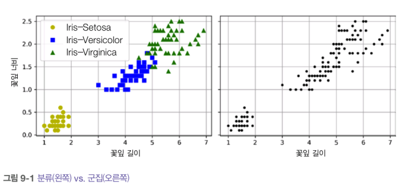

# 9장_비지도 학습

추가 일시: 2025년 8월 16일 오후 8:34

# 9. 비지도 학습

- 비지도 학습의 종류
1. 군집
    - 비슷한 샘플을 클러스터로 모은다.
2. 이상치 탐지
    - 정상 데이터(정상치)가 어떻게 보이는지 학습 후 비정상 샘플(이상치)을 감지하는데 사용
3. 밀도 추정
    - 데이터셋 생성 확률 과정의 확률 밀도 함수(PDF)추정
    - 밀도가 매우 낮은 영역에 놓인 샘플이 이상치일 가능성 높음

## 9.1 군집

> 군집이란?
> 

비슷한 샘플을 구별해 하나의 클러스터 또는 비슷한 샘플의 그룹으로 할당하는 작업



- 분류(왼쪽) : 지도학습 → 레이블이 되어 있음
    - 로지스틱 회귀, SVM, 랜덤 포레스트 등 분류 알고리즘
- 군집(오른쪽) : 비지도 학습

❗군집의 적용

1. 고객 분류
2. 데이터 분석
3. 차원 축소 기법
4. 특성 공학
5. 이상치 탐지
6. 준지도 학습
7. 검색 엔진
8. 이미지 분할

→ 군집 알고리즘들은…

- k-평균
- DBSCAN

### 9.1.1 k-평균


→ 레이블이 없는 데이터셋에서, 반복 몇 번으로 이런 데이터셋을 빠르고 효율적으로 클러스터로 묶을 수 있는 알고리즘


❗샘플 대부분은 적절한 클러스터에 할당 되었지만 몇 개(ex. 분홍색, 노란색 경계)는 레이블이 잘못 분류됨

> k-평균 알고리즘은 클러스터의 크기가 많이 다르면 잘 작동하지 않는다!
> 

→ 하드군집(샘플을 하나의 클러스터에 할당)보다 소프트 군집(클러스터마다 샘플에 점수 부여)이 유용할수도?

```python
>>> kmeans.transform(X_new).round(2)
array([[2.81, 0.33, 2.9, 1.49, 2.89],
[5.81, 2.8, 5.85, 4.48, 5.84],
[1.21, 3.29, 0.29, 1.69, 1.71],
[0.73, 3.22, 0.36, 1.55, 1.22]])
```

ex. 첫 번째 샘플이 첫 번째 센트로이드에서 약 2.81, 두 번째 샘플이 두 번째 센트로이드에서 0.33 떨어짐

→ 고차원 데이터셋을 이렇게 변환하면 k차원 데이터셋이 만들어짐(매우 효율적인 비선형 차원 축소)

- **k-평균 알고리즘**

> 센트로이드가 주어진다고 가정!
> 
1. 데이터셋에 있는 모든 샘플에 가장 가까운 센트로이드 클러스터 할당
2. 모든 샘플의 레이블이 주어진다면 각 클러스터에 속한 샘플의 평균 계산하여 모든 센트로이드 구함

🤔 레이블이나 센트로이드가 주어지지 않으면?

1. 센트로이드를 랜덤하게 선정
2. 샘플에 레이블을 할당 → 샌트로이드 업데이트
3. 샘플에 레이블 할당 → 센트로이드 업데이트

( 센트로이드에 변화가 없을 때까지 반복)


1. 센트로이드를 랜덤하게 초기화(왼쪽 위)
2. 샘플에 레이블 할당(오른쪽 위)
3. 센트로이드 업데이트(왼쪾 가운데)
4. 샘플에 다시 레이블 할당(오른쪽 가운데)
5. 계속 반복

→ 알고리즘의 수렴은 보장됨. 그런데, 적절한 솔루션으로 수렴 못할수도… (센트로이드 초기화에 달림)


💡 센트로이드 초기화를 개선해보자!

- **센트로이드 초기화 방법**
1. 센트로이드 위치를 근사하게 알 수 있다면…init 매개변수에 센트로이드 리스트를 담은 넘파이 배열 지정후 n_init=1로 설정

```python
good_init = np.array([[-3, 3], [-3, 2], [-3, 1], [-1, 2], [0, 2]])
kmeans = KMeans(n_clusters=5, init=good_init, n_init=1, random_state=42)
kmeans.fit(X)
```

1. 랜덤 초기화를 다르게 하여 여러 번 알고리즘을 실행하고 가장 좋은 솔루션 선택
2. k-평균++ 알고리즘 : 다른 센트로이드와 거리가 먼 센트로이드를 선택하는 똑똑한 초기화 단계 소개

→ k-평균 알고리즘이 최적이 아닌 솔루션으로 수렴할 가능성을 크게 낮춤

- **k-평균 속도 개선과 미니배치 k-평균**

> 클러스터가 많은 일부 대규모 데이터셋에서 불필요한 거리 계산을 피함으로써 알고리즘의 속도를 상당히 높일 수 있다!
> 

→ 삼각 부등식 (두 점 사이의 직선은 항상 가장 짧은 거리가 된다) 사용, 샘플과 센트로이드 사이의 거리를 위한 하한선과 상한선 유지

❗단, 데이터셋에 따라 훈련 속도가 느려질수도 있음

> 전체 데이터셋을 사용해 반복하지 않고 각 반복마다 미니배치를 사용해 센트로이드를 조금씩 이동
> 


- **최적의 클러스터 개수 찾기**

일반적으로 클러스터 개수(k)를 어떻게 설정할지 쉽게 알 수 없음


🤔 가장 작은 이너셔를 가진 모델을 선택하면 안될까?

k=3일 때, 이너셔 : 653.2

k=5일 때, 이너셔 : 211.6

k=8일 때, 이너셔 : 119.1

—> 좋은 성능 지표가 아님!


- 이너셔를 k의 함수로 그래프를 그린 것.

💡k=4까지 이너셔가 빠르게 감소하다가 k=4부터 느리게 감소(k=4 지점이 엘보임)

→ k=4가 좋은 선택이 됨

😭그런데…. 이 방법 뭔가 좀 엉성함

**실루엣 점수** 사용!

- 모든 샘플에 대한 실루엣 계수의 평균
    - -1 ≤샘플의 실루엣 계수 = (b-a)/max(a,b) ≤ 1
    - a : 동일한 클러스터에 있는 다른 샘플까지 평균 거리(클러스터 내부의 평균 거리)
    - b : 가장 가까운 클러스터까지 평균 거리
    - 실루엣 계수에 따른 구분
        1.  1에 가까우면 자신의 클러스터 안에 잘 속해 있고 다른 클러스터와 멀리 떨어짐
        2. -1에 가까우면 이 샘플이 잘못된 클러스터에 할당
        3. 0에 가까우면 클러스터 경계에 위치


- 실루엣 다이어그램

: 모든 샘플의 실루엣 계수를 할당된 클러스터와 계수 값으로 정렬


- 그래프 높이 : 클러스터가 포함하는 샘플의 개수
- 너비 : 이 클러스터에 포함된 샘플의 정렬된 실루엣 계수(넓을수록 좋음)
- 수직 파선 : 각 클러스터 개수에 해당하는 평균 실루엣 점수(많은 샘플이 파선의 왼쪽에서 멈추면 클러스터의 샘플이 다른 클러스터랑 가깝다는 것을 의미하므로 나쁜 클러스터임)

### 9.1.2 k-평균의 한계

1. 최적이 아닌 솔루션을 피하기 위해서는 알고리즘을 여러 번 실행해야함
2. 클러스터 개수를 지정해야함
3. 클러스터의 크기 또는 밀집도가 서로 다르거나 원형이 아닌 경우 잘 작동하지 않음


### 9.1.3 군집을 사용한 이미지 분할

> 이미지 분할?
> 

이미지를 여러 개의 segment로 분할!

1. 색상 분할
2. 시맨틱 분할
3. 인스턴스 분할
- `Pillow` 패키지 사용


### 9.1.4 군집을 사용한 준지도 학습

- 레이블이 없는 데이터가 많고 레이블이 있는 데이터는 적을 때 사용

ex. 1797개 숫자 데이터셋에 50개 샘플에 대한 레이블만 있다고 가정

1. 50개 샘플에서 로지스특 회귀 모델 훈련

→ 정확도가 74.8%에 불과함. 

개선해보자!!

1. 훈련 세트를 50개의 클러스터로 모음
2. 각 클러스터에서 센트로이드에 가장 가까운 이미지(대표 이미지)를 찾는다


1. 이미지를 보고 수동으로 레이블 할당
2. 레이블된 50개 샘플로 모델 훈련

→ 정확도가 84.9%로 상승!

1. 레이블을 동일한 클러스터에 있는 모든 샘플로 전파(레이블 전파)

→ 정확도가 89.4%로 상승!

1. 클러스터 중심에서 가장 먼 1%의 샘플 무시(일부 이상치 제거)

→ 정확도가 90.9%로 상승!

### 9.1.5 DBSCAN

- 밀집된 연속된 지역을 클러스터로 정의
1. 알고리즘이 각 샘플에서 작은 거리인 엡실론 내(엡실론 이웃)에 샘플이 몇 개 놓여 있는지 센다
2. 엡실론-이웃 내에 적어도 min_samples개 샘플이 있다면 이를 핵심 샘플로 간주
3. 핵심 샘플의 이웃에 있는 모든 샘플은 동일한 클러스터.
4. 핵심 샘플이 아니고 이웃도 아닌 샘플은 이상치


❗새로운 샘플에 대해 클러스터를 예측할 수 없다

→ 사용자가 필요한 예측기를 선택해야함!

### 9.1.6 다른 군집 알고리즘

1. 병합 군집
- 클러스터 계층을 밑바닥부터 위로 쌓아 구성
- 대규모 샘플에도 잘 적용

1. BIRCH
- 특성 개수가 너무 많지 않으면 (20개 이하) k-평균보다 빠르고 비슷
- 대용량 데이터셋 다루기 가능

1. 평균-이동
- 각 샘플을 중심으로 하는 원을 그림
- 원마다 안에 포함된 모든 샘플의 평균 구함
- 원의 중심을 평균점으로 이동
- 모든 원이 움직이지 않을 때까지 이러한 평균-이동 계속
- 대규모 데이터셋에는 적합x

1. 유사도 전파
- 모든 샘플은 자신을 대표할 다른 샘플을 선택할 때까지 샘플 간에 메시지를 반복적으로 교환
- 이렇게 선출된 샘플 : 예시
- 각 예시와 이를 선출한 모든 샘플은 하나의 클러스터 형성

1. 스펙트럼 군집
- 샘플 사이의 유사도 행렬을 받아 저차원 임베딩을 만듦(행렬의 차원 축소)
- 이 저차원 공간에서 또다른 군집 알고리즘 사용(ex. k-평균)
- 샘플 개수가 매우 많거나 클러스터의 크기가 매우 다르면 잘 작동하지 않음

## 9.2 가우스 혼합

> 가우스 혼합 모델(GMM)?
> 

→ 샘플이 파라미터가 알려지지 않은 여러 개의 혼합된 가우스 분포에서 생성되었다고 가정하는 확률 모델

하나의 가우스 분포에서 생성된 모든 샘플은 하나의 클러스터(타원형) 형성

- `GaussianMixture`  클래스

→ 데이터셋이 주어지면 가중치, 전체 분포의 파라미터를 추정

```python
from sklearn.mixture import GaussianMixture

gm=GaussianMixture(n_components=3, n_init=10, random_state=42)
gm.fit(X)
```

결과

- 세 클러스터 중 두 클러스터는 각각 500개의 샘플로 생성, 세 번째 클러스터에는 250개의 샘플만 포함

(가중치 : 0.4, 0.4, 0.2)

→ 알고리즘이 찾은 값과 대략적으로 같고, 평균과 분산 행렬도 알고리즘이 찾은 것과 매우 비슷 

🤔어떻게?

- 기댓값-최대화(EM) 알고리즘 사용

: 클러스터 파라미터를 랜덤하게 초기화하고 수렴할 때까지 두 단계 반복

1. 샘플을 클러스터에 할당(기댓값 단계)
2. 크러스터 업데이트(최대화 단계)
3. 클러스터에 속할 추정 확률(샘플에 대한 클러스터의 책임)로 샘플에 가중치가 적용됨

- GMM : 생성모델


→ 모데의 클러스터 평균, 결정 경계(파선), 밀도 등고선 나타냄

### 9.2.1 가우스 혼합을 사용한 이상치 탐지

> 밀도가 낮은 지역에 있는 모든 샘플을 이상치로 본다!
> 

→ 밀도 임곗값을 정해야함.


- 특이치 탐지 : 이상치로 오염되지 않은 ‘깨끗한’ 데이터셋에서 훈련하는 점이 이상치 탐지와 다르다

### 9.2.2 클러스터 개수 선택

> 가우스 혼합에서는 이너셔, 실루엣 점수를 사용할 수 없음. 이 지표들은 클러스터가 타원형이거나 크기가 다를 때 안정적이지 않다.
> 

💡 BIC, AIC같은 이론적 정보 기준을 최소화하는 모델을 찾는다.


- BIC, AIC 모두 학습할 파라미터가 많은 모델에게 벌칙을 가하고 데이터에 잘 맞는 모델에게 보상을 더함.


k=3에서 BIC, AIC모두 가장 작으므로 k=3이 최선의 선택임

### 9.2.3 베이즈 가우스 혼합 모델

- `BayesianGausssianMixture` : 불필요한 클러스터의 가중치를 0으로 만듦

❗가우스 혼합모델은 타원형 클러스터에만 잘 작동

### 9.2.4 이상치 탐지와 특이치 탐지를 위한 알고리즘

1. Fast-MCD
- 이상치 탐지에 유용
- 샘플이 하나의 가우스 분포에서 생성되었다고 가정
- 가우스 분포의 파라미터를 추정할 때 이상치로 의심되는 샘플 무시

1. 아이솔레이션 포레스트
- 고차원 데이터셋에서 이상치 탐지
- 랜덤으로 성장한 결정 트리로 구성된 랜덤 포레스트 만듦
- 각 노드에서 특성을 랜덤하게 선택해서 랜덤한 임곗값을 골라 데이터셋을 둘로 나누고 점차 분리되어 모든 샘플이 다른 샘플과 분리됨

1. LOF
- 주어진 샘플 주위의 밀도와 이웃 주위의 밀도를 비교

1. one-class SVM
- 특이치 탐지에 잘 맞음
- 모든 샘플을 고차원 공간에 매핑하고 이 고차원 공간에 선형 SVM 분류기를 사용해 두 클래스 분리
- 원본 공간에서는 모든 샘플을 둘러싼 작은 영역을 찾음
- 새로운 샘플이 이 영역 안에 놓이지 않으면 이상치

1. PCA
- 이상치의 재구성 오차가 샘플의 재구성 오차보다 크다 → 이상치 탐지에 효과적